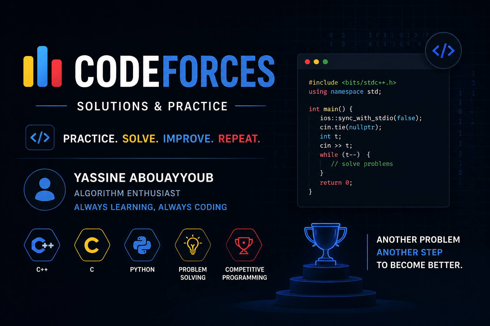

# Codeforces Solutions

A collection of my personal solutions for problems from Codeforces.

This repository is organized by **problem rating** to track progress and improve problem-solving skills in algorithms, data structures, and competitive programming.

## Repository Structure

```text
codeforces-solutions/
├── 800/
├── 900/
├── 1000/
├── 1100/
└── README.md
```

Each folder contains problems with the corresponding difficulty rating.

## Goals

* Improve logical thinking
* Practice algorithms and data structures
* Build consistency in competitive programming
* Track personal progress over time
* Prepare for technical interviews and contests

## Languages Used

* Python

## Example Problem Structure

```text
800/
└── 71A_Way_Too_Long_Words/
    ├── solution.py
    └── README.md
```

## Progress

| Rating | Solved |
| ------ | ------ |
| 800    | 1      |
| 900    | 0      |
| 1000   | 0      |

## Platform

Problems solved from Codeforces.

## Author

**Yassine Abouayyoub**
